# FocusTime

FocusTime is a web application designed to help users stay productive by leveraging the Pomodoro technique, a time management method that alternates between focused work sessions and short breaks. The app is designed for individuals who want to improve their focus, manage their time efficiently, and prevent burnout. With customizable timers, notifications, and a dark mode feature, FocusTime is a flexible tool for any working environment.

## Features

### Existing Features

- **Wireframes**

  - The following wireframes represent the initial design of FocusTime. These include views for both the home page and the modals.

  - 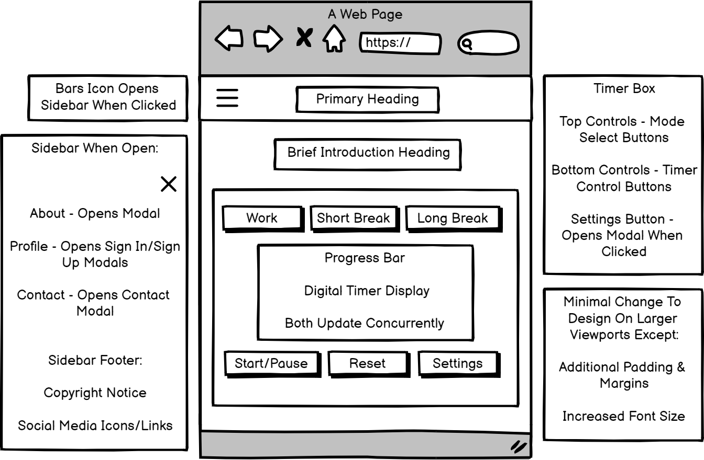

  - 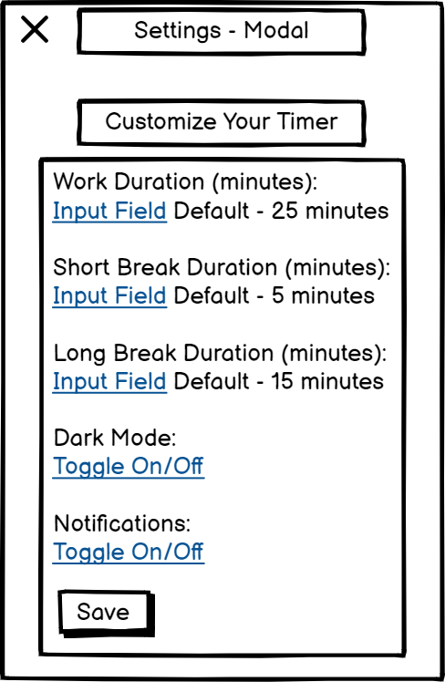

  - 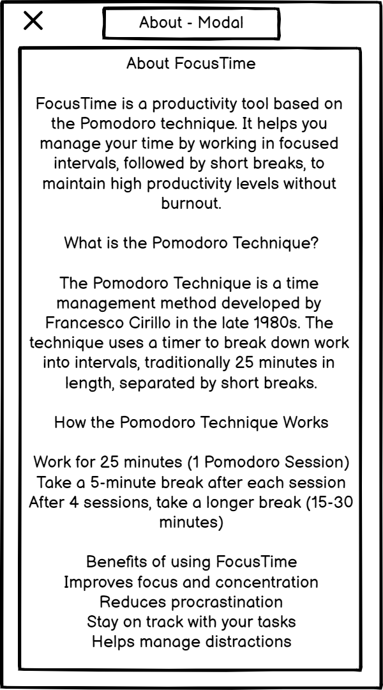

  - 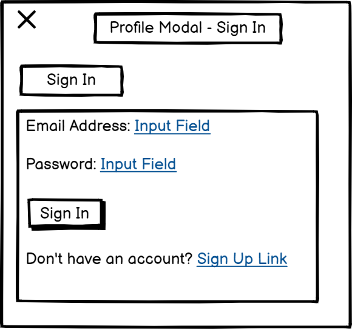

  - 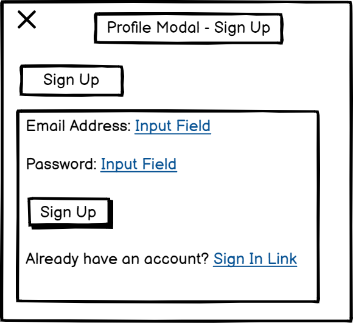

  - 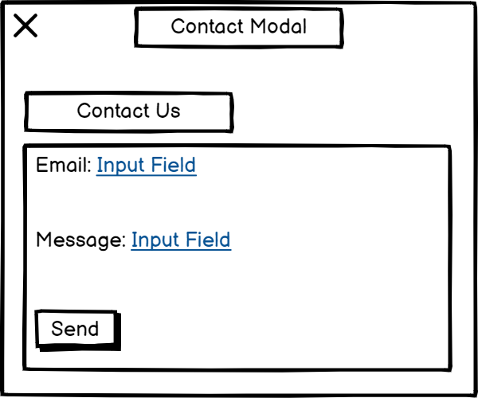

- **Responsive Sidebar Menu**

  - The app includes a fully responsive sidebar navigation menu that is accessible from all screen sizes. Users can open the sidebar by clicking the menu icon (hamburger icon) located in the top bar.

    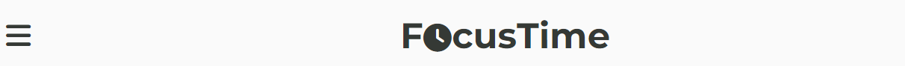

  - The sidebar provides links to key sections such as "About," "Profile," and "Contact," which are displayed as modals for a seamless user experience.

    

- **Customizable Timer**

  - The core functionality of FocusTime is a customizable timer. Users can select from Work Mode, Short Break, and Long Break modes, or customize the timer duration. The customizable timer helps users adjust their work or break duration according to their preferences, offering more flexibility compared to fixed Pomodoro intervals.

    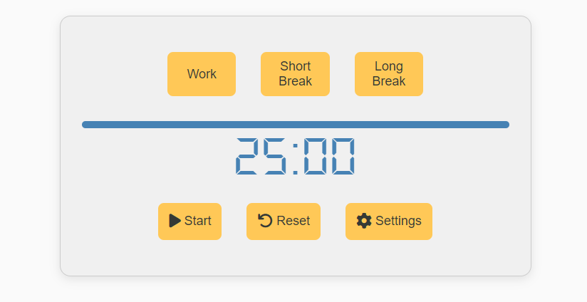

- **Progress Bar**

  - A visual progress bar indicates how much time is left in the current session.

    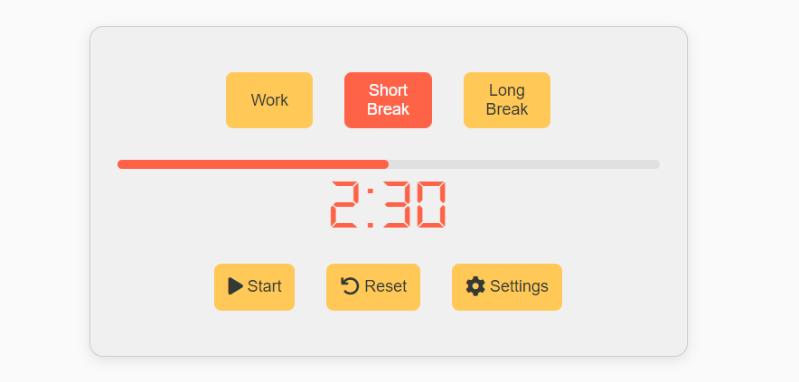

- **Dark Mode**

  - Dark Mode allows users to reduce eye strain when working in low-light environments, making it more comfortable for longer work sessions.

    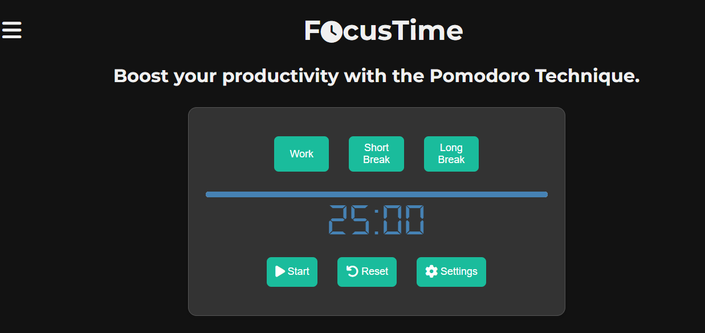

- **Notifications**

  - Users can enable or disable desktop notifications to alert them when the session ends, ensuring they don’t miss a break or the start of a new session.

  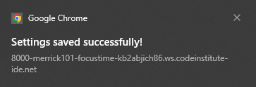

### Features Left to Implement

- **Task Management System**

  - Users will be able to create, manage, and track tasks directly within the app.

- **Session Tracking**
  - A session history will allow users to see how many Pomodoro cycles they’ve completed over a given period.

## Testing

### HTML Validation

- **Initial Test**

When passing the HTML code through the W3C HTML Validator, the following warnings and errors were detected:

- Warning: Misuse of aria-label in the close buttons of modals.
- Error: The for attribute was applied to elements that were not associated with a form control.
- Resolution: The aria-label attributes were removed from elements where they were not needed, and the for attributes were removed from labels associated with toggle switches, as they were not connected to a valid form input.

- **Final Test**
  - The HTML was validated using the [W3C Validator](https://validator.w3.org/), with no errors or warnings.
    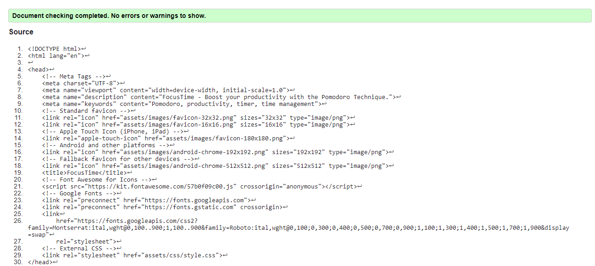

### CSS Validation

- The CSS was validated using the [W3C Jigsaw Validator](https://jigsaw.w3.org/css-validator/), passing without issues.
  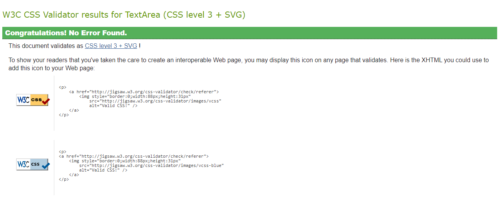

### JavaScript Validation

- **Initial Test**

Using JSHint, the following warnings were detected:

- Warning: "Do not use new for side effects." This referred to using the new Notification() syntax.
- Resolution: After refactoring the code for improved readability, I chose to retain the new Notification() usage for creating notifications, as it is necessary for the browser notification functionality.
- Warning: Use of ES6 features like const and arrow functions (=>) flagged by JSHint.
- Resolution: To resolve these warnings, I added the comment /_ jshint esversion: 6 _/ at the top of my JavaScript files to explicitly tell JSHint that ES6 features are being used intentionally. This resolved the ES6-related warnings.

- **Final Test**
  - The JavaScript code was validated using [JSHint](https://jshint.com/), and while it produced warnings about the `Notification` API, the application functioned as expected.
    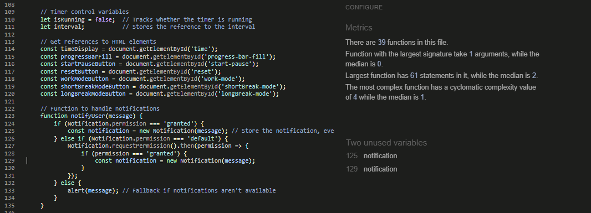

### Browser Compatibility

- The application was tested across various devices including mobile phones, tablets, and desktops, and performed consistently in Chrome, Firefox, and Safari.

### Known Bugs

- **Notifications API Warning**: The Notification API produces warnings about its usage but doesn't affect the functionality.

## Deployment

The project was deployed to GitHub Pages. The following steps were taken to deploy the project:

1. Navigate to the GitHub repository.
2. Click on the **Settings** tab.
3. Scroll down to the **GitHub Pages** section.
4. Under **Source**, select the **main** branch.
5. Click **Save** and wait for the page to refresh.

The live site can be accessed here: [FocusTime](https://merrick101.github.io/FocusTime/)

## Credits

### Content

- The Pomodoro Technique definition was adapted from [Wikipedia](https://en.wikipedia.org/wiki/Pomodoro_Technique).
- JavaScript progress bar logic was referenced from [MDN Web Docs](https://developer.mozilla.org/en-US/docs/Web/API/Canvas_API/Tutorial/Basic_animations).

### Media

- Icons used in the app are from [Font Awesome](https://fontawesome.com/).
- Favicons used are from [Icons8](https://icons8.com/).
- Fonts are provided by [Google Fonts](https://fonts.google.com/).

### Acknowledgements

- Thanks to Code Institute for the project template and assessment guidelines.
